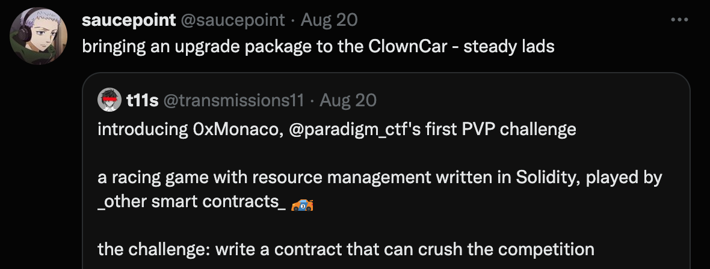
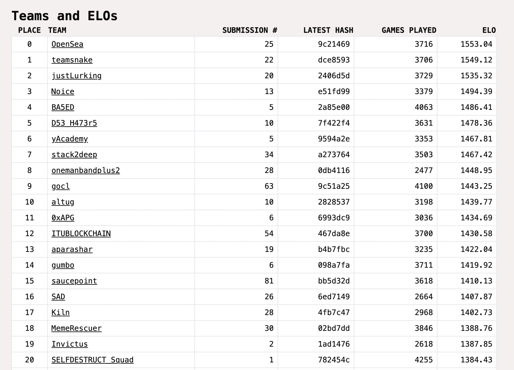
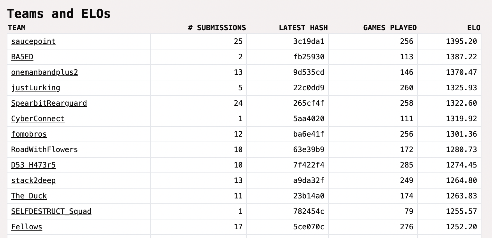
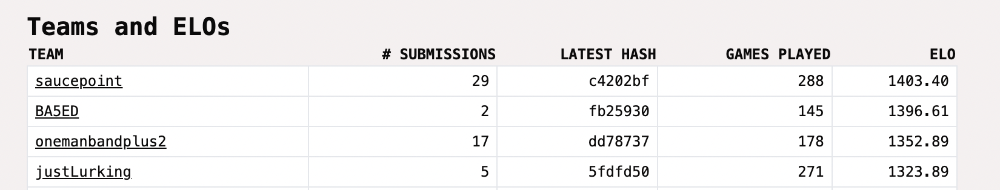
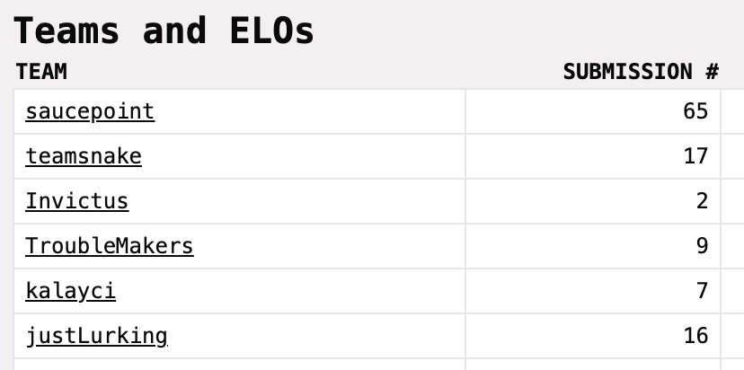
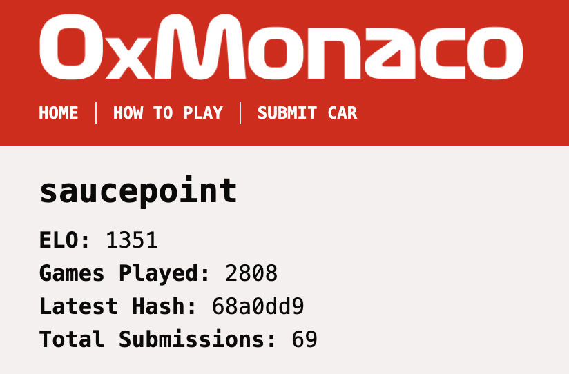

## 0xMonaco: ThePackage.sol

[The Game](https://0xmonaco.ctf.paradigm.xyz/howtoplay)

---



My original implementation `ClownCar.sol` was based on random number generation. It would've been funny to prove that random actions are viable, but after decent races followed by plummeting down the leaderboard I wanted to take it more serious. Enter `ThePackage.sol`, an entire upgrade to the car.

---

## if() else if() else {}

Woo, yet another conditional-focused car. I'll focus on some interesting tid bits below:

* My inner gamer menality realized there's stages to the race. I was getting robbed at the finish line all too often
    * 4 stages: early game, mid game, mad-max, and flat out
    * analogous to [0age's race winning car](https://gist.github.com/0age/3600aebdd97981c60906c8cb50c13279)
    * also shouting out fellow racer Mark Toda for also [distinguishing stages](https://github.com/marktoda/paradigm-ctf/tree/main/src/monaco)

* Speed Demon Detection
    * A recurring "meta" was to hangout in 3rd place, build up momentum, and slingshot into first place at the end
    * If there's a speed demon behind us, *save the shell*
    ```solidity
        // check for a speed demon in the rear view mirror!
        // if so, we'll hold off shelling until the next turn
        uint256 lagSpeed;
        if (ourCarIndex == 0) {
            lagSpeed = allCars[1].speed < allCars[2].speed ? allCars[2].speed : allCars[1].speed;
        } else if (ourCarIndex == 1) {
            lagSpeed = allCars[2].speed;
        }
        
        // apply actions
        // if theres someone behind us & theyre going fast, save the shell instead
        if (toShell && lagSpeed < LAGGING_SPEED_DEMON) shell(car);
    ```

* Determining acceleration was relative to my opponents -- inspired by F1 DRS, overtake modes, and deltas
    * If the opponent is faster, calculate how much accelerant we need to match or exceed them
    * If the opponent is slower, apply an optional delta to speed up even faster
    ```solidity
        function drs(car, opp, uint256 delta, uint256 fasterCase) private pure returns (uint256 moreBoost) {
            moreBoost = (opp.speed < car.speed) ? fasterCase : (opp.speed + delta - car.speed);
        }
    ```


* Acting based on budget
   * To ensure appropriate use of coins, the different stages had budgets
   * Budgets were a fraction of the car's balance. For example in early-game, I could not spend more than 1/20th of my balance on accelerant
   * This was the final check before making an action, which helped consolidate the economy usage throughout different scenarios

* Parameters-galore
   * Theres a ton of constants & magic numbers
   * This lead to a lot of tuning & optimizations to capture different racing incidents. Hence the 81 submissions heh

---

## Proud Moments

Finished 15th and "in the points" (awarded some CTF points)


Held first place Saturday night


One of the first to break 1400 ELO (saturday night)



Held first place with 3 hours left. Opps too stronk at the end


Funny, unintentional 69
